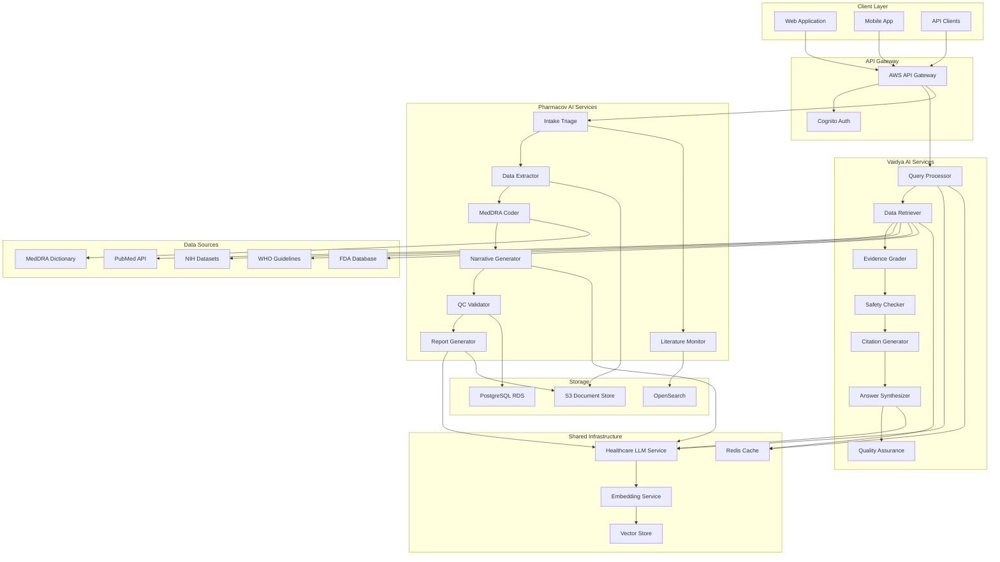

# Design Document: Astute AI Healthcare Platform

## Overview

Astute AI is a dual-platform healthcare solution combining Vaidya AI (medical search engine) and Pharmacov AI (drug safety monitor). The system leverages fine-tuned healthcare LLMs, multi-source data retrieval, and automated pharmacovigilance workflows to provide evidence-based clinical decision support and drug safety intelligence.

The architecture follows a microservices pattern with shared infrastructure for authentication, logging, and model serving. Both platforms share a common LLM backbone that improves through a synergistic learning loop.

## Architecture



## Components and Interfaces

### 1. Query Processor Service

Handles natural language medical query analysis and classification.

```typescript
interface MedicalQuery {
  id: string;
  rawText: string;
  userId: string;
  timestamp: Date;
  patientContext?: PatientContext;
}

interface PatientContext {
  age?: number;
  gender?: 'male' | 'female' | 'other';
  conditions?: string[];
  medications?: string[];
  allergies?: string[];
  pregnant?: boolean;
  lactating?: boolean;
  renalFunction?: 'normal' | 'impaired' | 'severe';
  hepaticFunction?: 'normal' | 'impaired' | 'severe';
}

interface ProcessedQuery {
  id: string;
  originalQuery: MedicalQuery;
  specialty: MedicalSpecialty;
  urgencyLevel: 'routine' | 'urgent' | 'emergent';
  intent: QueryIntent;
  entities: ExtractedEntity[];
  clarificationNeeded: boolean;
  clarificationPrompt?: string;
}

type MedicalSpecialty = 
  | 'cardiology' | 'oncology' | 'neurology' | 'pediatrics'
  | 'internal_medicine' | 'surgery' | 'psychiatry' | 'general';

type QueryIntent = 
  | 'diagnosis' | 'treatment' | 'drug_interaction' | 'dosing'
  | 'contraindication' | 'guideline' | 'prognosis' | 'general_info';

interface ExtractedEntity {
  text: string;
  type: 'drug' | 'condition' | 'symptom' | 'procedure' | 'lab_value';
  normalizedForm?: string;
  confidence: number;
}

interface QueryProcessorService {
  processQuery(query: MedicalQuery): Promise<ProcessedQuery>;
  extractEntities(text: string): Promise<ExtractedEntity[]>;
  classifyIntent(text: string): Promise<QueryIntent>;
  detectUrgency(text: string, entities: ExtractedEntity[]): Promise<string>;
}
```

### 2. Data Retriever Service

Orchestrates parallel searches across multiple medical data sources.

```typescript
interface DataSource {
  name: 'pubmed' | 'nih' | 'who' | 'cdc' | 'fda' | 'mimic';
  available: boolean;
  lastChecked: Date;
}

interface SearchResult {
  sourceId: string;
  source: DataSource['name'];
  title: string;
  abstract?: string;
  fullTextUrl?: string;
  publicationDate?: Date;
  authors?: string[];
  journal?: string;
  impactFactor?: number;
  citationCount?: number;
  studyType?: StudyType;
  relevanceScore: number;
}

type StudyType = 
  | 'meta_analysis' | 'systematic_review' | 'rct' 
  | 'cohort' | 'case_control' | 'case_report' | 'guideline' | 'expert_opinion';

interface RetrievalResult {
  queryId: string;
  results: SearchResult[];
  sourcesQueried: DataSource[];
  sourcesUnavailable: DataSource[];
  totalResults: number;
  retrievalTimeMs: number;
}

interface DataRetrieverService {
  search(query: ProcessedQuery): Promise<RetrievalResult>;
  searchPubMed(terms: string[], filters?: PubMedFilters): Promise<SearchResult[]>;
  searchFDA(drugNames: string[]): Promise<SearchResult[]>;
  getGuidelines(specialty: MedicalSpecialty, condition?: string): Promise<SearchResult[]>;
  checkSourceAvailability(): Promise<DataSource[]>;
}
```

### 3. Evidence Grader Service

Assesses and grades the quality of retrieved medical evidence.

```typescript
interface EvidenceLevel {
  level: 'I' | 'II' | 'III' | 'IV' | 'V';
  description: string;
}

interface GradedEvidence {
  searchResult: SearchResult;
  evidenceLevel: EvidenceLevel;
  qualityScore: number; // 0-100
  statisticalSignificance?: {
    pValue?: number;
    confidenceInterval?: [number, number];
    effectSize?: number;
  };
  recencyWeight: number; // 0-1, higher for newer
  peerReviewVerified: boolean;
  biasAssessment?: BiasAssessment;
}

interface BiasAssessment {
  selectionBias: 'low' | 'moderate' | 'high' | 'unclear';
  performanceBias: 'low' | 'moderate' | 'high' | 'unclear';
  detectionBias: 'low' | 'moderate' | 'high' | 'unclear';
  attritionBias: 'low' | 'moderate' | 'high' | 'unclear';
  reportingBias: 'low' | 'moderate' | 'high' | 'unclear';
  overallRisk: 'low' | 'moderate' | 'high';
}

interface EvidenceGraderService {
  gradeEvidence(results: SearchResult[]): Promise<GradedEvidence[]>;
  assessStudyQuality(result: SearchResult): Promise<number>;
  determineEvidenceLevel(result: SearchResult): Promise<EvidenceLevel>;
  calculateRecencyWeight(publicationDate: Date): number;
  verifyPeerReview(result: SearchResult): Promise<boolean>;
}
```

### 4. Safety Checker Service

Performs drug interaction and safety checks.

```typescript
interface DrugInteraction {
  drug1: string;
  drug2: string;
  severity: 'minor' | 'moderate' | 'major' | 'contraindicated';
  mechanism: string;
  clinicalEffect: string;
  management: string;
  references: string[];
}

interface SafetyAlert {
  type: 'interaction' | 'contraindication' | 'allergy' | 'dose_adjustment' 
      | 'pregnancy' | 'lactation' | 'renal' | 'hepatic';
  severity: 'info' | 'warning' | 'critical';
  message: string;
  affectedDrugs: string[];
  recommendation: string;
  references: string[];
}

interface SafetyCheckResult {
  queryId: string;
  interactions: DrugInteraction[];
  alerts: SafetyAlert[];
  overallRiskLevel: 'low' | 'moderate' | 'high' | 'critical';
  requiresReview: boolean;
}

interface SafetyCheckerService {
  checkSafety(
    medications: string[], 
    patientContext?: PatientContext
  ): Promise<SafetyCheckResult>;
  checkDrugInteractions(drugs: string[]): Promise<DrugInteraction[]>;
  checkContraindications(drug: string, conditions: string[]): Promise<SafetyAlert[]>;
  checkAllergyRisk(drug: string, allergies: string[]): Promise<SafetyAlert[]>;
  checkDoseAdjustment(
    drug: string, 
    renalFunction?: string, 
    hepaticFunction?: string
  ): Promise<SafetyAlert[]>;
}
```

### 5. Citation Generator Service

Creates properly formatted citations for all referenced sources.

```typescript
interface Citation {
  id: string;
  sourceResult: SearchResult;
  pubmedId?: string;
  doi?: string;
  trialRegistryNumber?: string;
  guidelineVersion?: string;
  formattedCitation: string;
  authorCredentials?: AuthorCredential[];
  impactFactor?: number;
  accessUrl: string;
}

interface AuthorCredential {
  name: string;
  affiliation?: string;
  credentials?: string[];
}

interface CitationGeneratorService {
  generateCitations(results: GradedEvidence[]): Promise<Citation[]>;
  formatCitation(result: SearchResult, style: CitationStyle): string;
  lookupPubMedId(result: SearchResult): Promise<string | null>;
  lookupDOI(result: SearchResult): Promise<string | null>;
  getAuthorCredentials(result: SearchResult): Promise<AuthorCredential[]>;
}

type CitationStyle = 'ama' | 'apa' | 'vancouver' | 'harvard';
```

### 6. Answer Synthesizer Service

Integrates evidence into coherent clinical recommendations.

```typescript
interface TreatmentOption {
  name: string;
  description: string;
  evidenceStrength: 'strong' | 'moderate' | 'weak' | 'expert_opinion';
  supportingEvidence: Citation[];
  contraindications: string[];
  sideEffects: string[];
  costConsiderations?: string;
}

interface SynthesizedAnswer {
  queryId: string;
  summary: string; // Plain language summary
  detailedResponse: string;
  treatmentOptions: TreatmentOption[];
  safetyAlerts: SafetyAlert[];
  guidelineAlignment: GuidelineAlignment[];
  citations: Citation[];
  confidenceScore: number;
  limitations: string[];
}

interface GuidelineAlignment {
  guidelineName: string;
  organization: string;
  version: string;
  alignmentStatus: 'aligned' | 'partially_aligned' | 'not_addressed' | 'conflicts';
  relevantSection?: string;
}

interface AnswerSynthesizerService {
  synthesize(
    query: ProcessedQuery,
    evidence: GradedEvidence[],
    safetyResult: SafetyCheckResult,
    citations: Citation[]
  ): Promise<SynthesizedAnswer>;
  generateSummary(evidence: GradedEvidence[]): Promise<string>;
  rankTreatmentOptions(options: TreatmentOption[]): TreatmentOption[];
  checkGuidelineAlignment(
    recommendations: string[], 
    specialty: MedicalSpecialty
  ): Promise<GuidelineAlignment[]>;
}
```

### 7. Quality Assurance Service

Validates answers and detects potential issues.

```typescript
interface QualityCheckResult {
  answerId: string;
  hallucinationScore: number; // 0-1, lower is better
  confidenceScore: number; // 0-1, higher is better
  completenessScore: number; // 0-1
  contradictions: Contradiction[];
  uncertaintyFlags: UncertaintyFlag[];
  requiresExpertReview: boolean;
  reviewReason?: string;
}

interface Contradiction {
  statement1: string;
  source1: Citation;
  statement2: string;
  source2: Citation;
  description: string;
}

interface UncertaintyFlag {
  section: string;
  reason: string;
  suggestedAction: string;
}

interface QualityAssuranceService {
  validateAnswer(answer: SynthesizedAnswer): Promise<QualityCheckResult>;
  detectHallucinations(answer: SynthesizedAnswer, evidence: GradedEvidence[]): Promise<number>;
  calculateConfidence(answer: SynthesizedAnswer): Promise<number>;
  findContradictions(evidence: GradedEvidence[]): Promise<Contradiction[]>;
  checkCompleteness(query: ProcessedQuery, answer: SynthesizedAnswer): Promise<number>;
  shouldTriggerExpertReview(qualityResult: QualityCheckResult): boolean;
}
```

### 8. ICSR Case Processor Service

Handles adverse event report intake, extraction, and processing.

```typescript
interface AdverseEventReport {
  id: string;
  sourceType: 'email' | 'call_transcript' | 'pdf' | 'web_form' | 'literature';
  rawContent: string;
  attachments: Attachment[];
  receivedDate: Date;
  status: CaseStatus;
}

interface Attachment {
  id: string;
  filename: string;
  mimeType: string;
  content: Buffer;
  classification?: DocumentClassification;
}

type DocumentClassification = 'icsr' | 'medical_record' | 'lab_report' | 'other' | 'unknown';
type CaseStatus = 'new' | 'triaged' | 'extracted' | 'coded' | 'reviewed' | 'submitted';

interface TriageResult {
  reportId: string;
  classification: 'adverse_event' | 'product_quality' | 'medical_inquiry' | 'non_case';
  confidence: number;
  icsrDetected: boolean;
  requiresHumanReview: boolean;
  reviewReason?: string;
}

interface ExtractedCaseData {
  reportId: string;
  patient: PatientData;
  drugs: DrugData[];
  events: EventData[];
  reporter: ReporterData;
  narrative: string;
  extractionConfidence: Record<string, number>;
  pendingApprovals: string[]; // Fields needing human approval
}

interface PatientData {
  initials?: string;
  age?: number;
  ageUnit?: 'years' | 'months' | 'days';
  gender?: string;
  weight?: number;
  height?: number;
  medicalHistory?: string[];
}

interface DrugData {
  name: string;
  genericName?: string;
  dose?: string;
  route?: string;
  indication?: string;
  startDate?: Date;
  endDate?: Date;
  suspect: boolean;
  whoCode?: string;
}

interface EventData {
  verbatimTerm: string;
  meddraLLT?: string;
  meddraPT?: string;
  meddraSOC?: string;
  onsetDate?: Date;
  outcome?: string;
  seriousness: SeriousnessCriteria;
}

interface SeriousnessCriteria {
  death: boolean;
  lifeThreatening: boolean;
  hospitalization: boolean;
  disability: boolean;
  congenitalAnomaly: boolean;
  medicallySignificant: boolean;
}

interface CaseProcessorService {
  triageReport(report: AdverseEventReport): Promise<TriageResult>;
  classifyAttachments(attachments: Attachment[]): Promise<Attachment[]>;
  extractCaseData(report: AdverseEventReport): Promise<ExtractedCaseData>;
  suggestMedDRACoding(verbatimTerm: string): Promise<MedDRASuggestion[]>;
  suggestWHODrugCoding(drugName: string): Promise<WHODrugSuggestion[]>;
  generateNarrative(caseData: ExtractedCaseData): Promise<string>;
  checkDuplicate(caseData: ExtractedCaseData): Promise<DuplicateCheckResult>;
}

interface MedDRASuggestion {
  llt: string;
  pt: string;
  soc: string;
  confidence: number;
}

interface WHODrugSuggestion {
  drugCode: string;
  drugName: string;
  manufacturer?: string;
  confidence: number;
}

interface DuplicateCheckResult {
  potentialDuplicates: Array<{
    caseId: string;
    similarityScore: number;
    matchingFields: string[];
  }>;
  isDuplicate: boolean; // Human must confirm
}
```

### 9. QC Validator Service

Performs quality control checks on ICSR cases.

```typescript
interface QCValidationResult {
  caseId: string;
  isValid: boolean;
  errors: ValidationError[];
  warnings: ValidationWarning[];
  consistencyIssues: ConsistencyIssue[];
}

interface ValidationError {
  field: string;
  errorType: 'missing_mandatory' | 'invalid_format' | 'out_of_range';
  message: string;
}

interface ValidationWarning {
  field: string;
  warningType: 'suspicious_value' | 'inconsistent' | 'unusual';
  message: string;
}

interface ConsistencyIssue {
  fields: string[];
  issueType: 'date_mismatch' | 'gender_pregnancy' | 'narrative_mismatch' | 'contradiction';
  description: string;
  narrativeExcerpt?: string;
  structuredValue?: string;
}

interface QCValidatorService {
  validateCase(caseData: ExtractedCaseData): Promise<QCValidationResult>;
  checkMandatoryFields(caseData: ExtractedCaseData): ValidationError[];
  checkDateConsistency(caseData: ExtractedCaseData): ConsistencyIssue[];
  checkGenderPregnancy(patient: PatientData, events: EventData[]): ConsistencyIssue[];
  checkNarrativeConsistency(
    narrative: string, 
    structuredData: ExtractedCaseData
  ): Promise<ConsistencyIssue[]>;
}
```

### 10. Literature Monitor Service

Screens medical publications for safety signals.

```typescript
interface Publication {
  id: string;
  title: string;
  abstract: string;
  fullText?: string;
  journal: string;
  publicationDate: Date;
  authors: string[];
  doi?: string;
  pmid?: string;
}

interface LiteratureScreeningResult {
  publicationId: string;
  relevance: 'relevant' | 'not_relevant' | 'uncertain';
  relevanceScore: number;
  summary: LiteratureSummary;
  potentialICSRs: PotentialICSR[];
  highlights: TextHighlight[];
}

interface LiteratureSummary {
  keyEvents: string[];
  drugMentions: string[];
  studyType: string;
  patientCount?: number;
  mainFindings: string;
}

interface PotentialICSR {
  excerpt: string;
  drugEventPairs: Array<{ drug: string; event: string }>;
  confidence: number;
  requiresValidation: boolean;
}

interface TextHighlight {
  text: string;
  startOffset: number;
  endOffset: number;
  highlightType: 'event' | 'drug' | 'outcome' | 'timeline';
}

interface JournalPriority {
  journalName: string;
  priorityScore: number;
  icsrYield: number; // Historical ICSR detection rate
  therapeuticAreas: string[];
}

interface LiteratureMonitorService {
  screenPublication(publication: Publication): Promise<LiteratureScreeningResult>;
  classifyRelevance(publication: Publication): Promise<{ relevance: string; score: number }>;
  summarizeForTriage(publication: Publication): Promise<LiteratureSummary>;
  detectPotentialICSRs(publication: Publication): Promise<PotentialICSR[]>;
  highlightKeyContent(fullText: string): Promise<TextHighlight[]>;
  prioritizeJournals(journals: string[]): Promise<JournalPriority[]>;
}
```

### 11. Report Generator Service

Creates aggregate safety reports and visualizations.

```typescript
interface AggregateReport {
  id: string;
  reportType: 'PSUR' | 'PBRER' | 'DSUR' | 'signal_report';
  drugName: string;
  reportingPeriod: { start: Date; end: Date };
  sections: ReportSection[];
  figures: ReportFigure[];
  tables: ReportTable[];
  status: 'draft' | 'review' | 'approved' | 'submitted';
}

interface ReportSection {
  sectionName: string;
  content: string;
  generatedBy: 'ai' | 'human';
  reviewStatus: 'pending' | 'approved' | 'revised';
  revisions?: string[];
}

interface ReportFigure {
  figureType: 'time_to_onset' | 'cumulative_cases' | 'seriousness_distribution' 
            | 'age_distribution' | 'geographic_distribution';
  title: string;
  data: any;
  imageUrl?: string;
}

interface ReportTable {
  tableType: 'case_summary' | 'event_frequency' | 'demographic' | 'outcome';
  title: string;
  headers: string[];
  rows: string[][];
}

interface SignalAnalysis {
  drugEventPair: { drug: string; event: string };
  disproportionalityScore: number;
  prr: number; // Proportional Reporting Ratio
  ror: number; // Reporting Odds Ratio
  ic: number;  // Information Component
  caseCount: number;
  signalStrength: 'weak' | 'moderate' | 'strong';
  recommendation: string;
}

interface TrendAnalysis {
  eventType: string;
  timeSeries: Array<{ period: string; count: number }>;
  trend: 'increasing' | 'stable' | 'decreasing';
  changePoint?: Date;
  statisticalSignificance: number;
}

interface ReportGeneratorService {
  generateReport(
    reportType: AggregateReport['reportType'],
    drugName: string,
    period: { start: Date; end: Date }
  ): Promise<AggregateReport>;
  analyzeSignals(drugName: string): Promise<SignalAnalysis[]>;
  analyzeTrends(drugName: string, eventTypes: string[]): Promise<TrendAnalysis[]>;
  draftSection(sectionName: string, data: any): Promise<string>;
  generateFigure(figureType: ReportFigure['figureType'], data: any): Promise<ReportFigure>;
  checkConsistency(report: AggregateReport): Promise<ConsistencyIssue[]>;
}
```

## Data Models

### Core Entities

```typescript
// User and Authentication
interface User {
  id: string;
  email: string;
  role: 'healthcare_professional' | 'pharmacovigilance_specialist' | 'admin';
  organization?: string;
  specialty?: MedicalSpecialty;
  credentials?: string[];
  createdAt: Date;
  lastLoginAt: Date;
}

// Query History
interface QueryHistory {
  id: string;
  userId: string;
  query: MedicalQuery;
  processedQuery: ProcessedQuery;
  answer: SynthesizedAnswer;
  qualityCheck: QualityCheckResult;
  feedback?: UserFeedback;
  createdAt: Date;
}

interface UserFeedback {
  rating: 1 | 2 | 3 | 4 | 5;
  helpful: boolean;
  accurate: boolean;
  comments?: string;
}

// ICSR Case
interface ICSRCase {
  id: string;
  reportId: string;
  caseNumber: string;
  version: number;
  status: CaseStatus;
  triageResult: TriageResult;
  extractedData: ExtractedCaseData;
  codedData: CodedCaseData;
  narrative: string;
  qcResult: QCValidationResult;
  medicalReview?: MedicalReview;
  submissionHistory: SubmissionRecord[];
  createdAt: Date;
  updatedAt: Date;
  createdBy: string;
  updatedBy: string;
}

interface CodedCaseData {
  events: Array<EventData & { 
    codingApproved: boolean; 
    approvedBy?: string;
    approvedAt?: Date;
  }>;
  drugs: Array<DrugData & {
    codingApproved: boolean;
    approvedBy?: string;
    approvedAt?: Date;
  }>;
}

interface MedicalReview {
  reviewerId: string;
  reviewDate: Date;
  causality: 'certain' | 'probable' | 'possible' | 'unlikely' | 'unassessable';
  seriousnessConfirmed: boolean;
  listedness: 'listed' | 'unlisted';
  comments: string;
}

interface SubmissionRecord {
  submissionDate: Date;
  authority: string;
  submissionType: 'initial' | 'followup' | 'nullification';
  acknowledgmentNumber?: string;
  status: 'pending' | 'accepted' | 'rejected';
}

// Model Training Data
interface TrainingDataPoint {
  id: string;
  source: 'vaidya_query' | 'pharmacov_case' | 'literature' | 'guideline';
  inputData: any;
  outputData: any;
  validated: boolean;
  validatedBy?: string;
  validatedAt?: Date;
  usedInTraining: boolean;
  trainingRunId?: string;
}

interface ModelVersion {
  id: string;
  modelName: string;
  version: string;
  trainingDataSources: string[];
  hallucinationRate: number;
  accuracyMetrics: Record<string, number>;
  deployedAt?: Date;
  status: 'training' | 'evaluating' | 'deployed' | 'deprecated';
}
```

### Database Schema (PostgreSQL)

```sql
-- Users table
CREATE TABLE users (
  id UUID PRIMARY KEY DEFAULT gen_random_uuid(),
  email VARCHAR(255) UNIQUE NOT NULL,
  role VARCHAR(50) NOT NULL,
  organization VARCHAR(255),
  specialty VARCHAR(100),
  credentials JSONB,
  created_at TIMESTAMP DEFAULT NOW(),
  last_login_at TIMESTAMP
);

-- Query history
CREATE TABLE query_history (
  id UUID PRIMARY KEY DEFAULT gen_random_uuid(),
  user_id UUID REFERENCES users(id),
  raw_query TEXT NOT NULL,
  processed_query JSONB NOT NULL,
  answer JSONB NOT NULL,
  quality_check JSONB,
  feedback JSONB,
  created_at TIMESTAMP DEFAULT NOW()
);

-- ICSR Cases
CREATE TABLE icsr_cases (
  id UUID PRIMARY KEY DEFAULT gen_random_uuid(),
  case_number VARCHAR(50) UNIQUE NOT NULL,
  version INTEGER DEFAULT 1,
  status VARCHAR(50) NOT NULL,
  report_source JSONB NOT NULL,
  triage_result JSONB,
  extracted_data JSONB,
  coded_data JSONB,
  narrative TEXT,
  qc_result JSONB,
  medical_review JSONB,
  created_at TIMESTAMP DEFAULT NOW(),
  updated_at TIMESTAMP DEFAULT NOW(),
  created_by UUID REFERENCES users(id),
  updated_by UUID REFERENCES users(id)
);

-- Case submissions
CREATE TABLE case_submissions (
  id UUID PRIMARY KEY DEFAULT gen_random_uuid(),
  case_id UUID REFERENCES icsr_cases(id),
  submission_date TIMESTAMP NOT NULL,
  authority VARCHAR(100) NOT NULL,
  submission_type VARCHAR(50) NOT NULL,
  acknowledgment_number VARCHAR(100),
  status VARCHAR(50) NOT NULL,
  response_data JSONB
);

-- Literature screening
CREATE TABLE literature_screenings (
  id UUID PRIMARY KEY DEFAULT gen_random_uuid(),
  publication_id VARCHAR(100) NOT NULL,
  pmid VARCHAR(20),
  doi VARCHAR(255),
  title TEXT NOT NULL,
  screening_result JSONB NOT NULL,
  potential_icsrs JSONB,
  screened_at TIMESTAMP DEFAULT NOW(),
  screened_by UUID REFERENCES users(id)
);

-- Aggregate reports
CREATE TABLE aggregate_reports (
  id UUID PRIMARY KEY DEFAULT gen_random_uuid(),
  report_type VARCHAR(50) NOT NULL,
  drug_name VARCHAR(255) NOT NULL,
  period_start DATE NOT NULL,
  period_end DATE NOT NULL,
  sections JSONB NOT NULL,
  figures JSONB,
  tables JSONB,
  status VARCHAR(50) NOT NULL,
  created_at TIMESTAMP DEFAULT NOW(),
  updated_at TIMESTAMP DEFAULT NOW()
);

-- Model versions
CREATE TABLE model_versions (
  id UUID PRIMARY KEY DEFAULT gen_random_uuid(),
  model_name VARCHAR(100) NOT NULL,
  version VARCHAR(50) NOT NULL,
  training_data_sources JSONB,
  hallucination_rate DECIMAL(5,4),
  accuracy_metrics JSONB,
  deployed_at TIMESTAMP,
  status VARCHAR(50) NOT NULL,
  created_at TIMESTAMP DEFAULT NOW()
);

-- Indexes
CREATE INDEX idx_query_history_user ON query_history(user_id);
CREATE INDEX idx_query_history_created ON query_history(created_at);
CREATE INDEX idx_icsr_cases_status ON icsr_cases(status);
CREATE INDEX idx_icsr_cases_case_number ON icsr_cases(case_number);
CREATE INDEX idx_literature_pmid ON literature_screenings(pmid);
CREATE INDEX idx_aggregate_reports_drug ON aggregate_reports(drug_name);
```


## Correctness Properties

*A property is a characteristic or behavior that should hold true across all valid executions of a system—essentially, a formal statement about what the system should do. Properties serve as the bridge between human-readable specifications and machine-verifiable correctness guarantees.*

### Property 1: Query Processing Completeness

*For any* valid medical query submitted to the Query_Processor, the output ProcessedQuery SHALL contain a non-null specialty classification, a valid urgency level (routine/urgent/emergent), a valid intent classification, and a list of extracted entities with confidence scores.

**Validates: Requirements 1.1, 1.2, 1.3, 1.4**

### Property 2: Evidence Level Assignment Validity

*For any* SearchResult processed by the Evidence_Grader, the resulting GradedEvidence SHALL have an evidence level in the set {I, II, III, IV, V}, a quality score between 0 and 100, and a recency weight between 0 and 1.

**Validates: Requirements 3.1, 3.2, 3.5**

### Property 3: Recency Weight Monotonicity

*For any* two SearchResults where result A has a more recent publication date than result B, the recency weight of A SHALL be greater than or equal to the recency weight of B.

**Validates: Requirements 3.5**

### Property 4: Drug Interaction Detection Completeness

*For any* set of medications submitted to the Safety_Checker, if a known drug-drug interaction exists between any pair, the SafetyCheckResult SHALL contain a DrugInteraction entry for that pair with a valid severity level.

**Validates: Requirements 4.1**

### Property 5: Patient Context Safety Alerts

*For any* SafetyChecker invocation with patient context containing pregnancy=true OR lactation=true OR renalFunction=impaired/severe OR hepaticFunction=impaired/severe, the SafetyCheckResult SHALL contain at least one SafetyAlert of the corresponding type for each applicable medication.

**Validates: Requirements 4.5, 4.6**

### Property 6: Citation Completeness

*For any* GradedEvidence included in a SynthesizedAnswer, there SHALL exist a corresponding Citation with a non-empty formattedCitation and accessUrl.

**Validates: Requirements 6.1, 6.2, 6.3, 6.4**

### Property 7: Confidence Score Validity

*For any* SynthesizedAnswer generated by the system, the confidenceScore SHALL be a number between 0 and 1, and if confidenceScore < 0.5, the QualityCheckResult.requiresExpertReview SHALL be true.

**Validates: Requirements 8.2, 8.6**

### Property 8: Hallucination Score Bounds

*For any* QualityCheckResult, the hallucinationScore SHALL be a number between 0 and 1, and the completenessScore SHALL be a number between 0 and 1.

**Validates: Requirements 8.1, 8.5**

### Property 9: Treatment Option Ranking Consistency

*For any* SynthesizedAnswer with multiple TreatmentOptions, the options SHALL be ordered such that for any adjacent pair (A, B), the evidence strength of A is greater than or equal to the evidence strength of B (using ordering: strong > moderate > weak > expert_opinion).

**Validates: Requirements 7.4**

### Property 10: ICSR Triage Classification Completeness

*For any* AdverseEventReport processed by the Case_Processor, the TriageResult SHALL have a classification in the set {adverse_event, product_quality, medical_inquiry, non_case} and a confidence score between 0 and 1.

**Validates: Requirements 9.2**

### Property 11: Extracted Field Approval Requirement

*For any* ExtractedCaseData produced by the Case_Processor, every field in extractionConfidence SHALL have a corresponding entry in pendingApprovals until explicitly approved by a human reviewer.

**Validates: Requirements 10.2, 10.5**

### Property 12: MedDRA Coding Suggestion Validity

*For any* verbatim adverse event term submitted to suggestMedDRACoding, the returned MedDRASuggestion list SHALL contain entries where each entry has non-empty llt, pt, and soc fields, and confidence between 0 and 1.

**Validates: Requirements 10.3**

### Property 13: Narrative Contains Structured Data

*For any* ExtractedCaseData with patient age, drug name, and event verbatim term, the generated narrative SHALL contain string representations of all three values.

**Validates: Requirements 10.6**

### Property 14: QC Validation Mandatory Field Detection

*For any* ExtractedCaseData missing a mandatory field (patient initials, at least one drug, at least one event), the QCValidationResult SHALL contain a ValidationError with errorType='missing_mandatory' for that field.

**Validates: Requirements 11.1**

### Property 15: Date Consistency Detection

*For any* ExtractedCaseData where an event onset date is before the drug start date for a suspect drug, the QCValidationResult SHALL contain a ConsistencyIssue with issueType='date_mismatch'.

**Validates: Requirements 11.2**

### Property 16: Gender-Pregnancy Validation

*For any* ExtractedCaseData where patient gender is 'male' AND any event relates to pregnancy, the QCValidationResult SHALL contain a ConsistencyIssue with issueType='gender_pregnancy'.

**Validates: Requirements 11.3**

### Property 17: Duplicate Detection Similarity Score

*For any* DuplicateCheckResult with potentialDuplicates.length > 0, each potential duplicate SHALL have a similarityScore between 0 and 1.

**Validates: Requirements 11.5, 11.6**

### Property 18: Literature Relevance Classification

*For any* Publication processed by the Literature_Monitor, the LiteratureScreeningResult SHALL have relevance in the set {relevant, not_relevant, uncertain} and relevanceScore between 0 and 1.

**Validates: Requirements 12.1**

### Property 19: Relevant Article Summary Completeness

*For any* LiteratureScreeningResult where relevance='relevant', the summary SHALL have non-empty keyEvents array, non-empty drugMentions array, non-empty studyType, and non-empty mainFindings.

**Validates: Requirements 12.2**

### Property 20: Signal Analysis Statistical Validity

*For any* SignalAnalysis produced by the Report_Generator, the disproportionalityScore, prr, ror, and ic SHALL all be non-negative numbers, and signalStrength SHALL be in the set {weak, moderate, strong}.

**Validates: Requirements 13.2**

### Property 21: Report Section Generation

*For any* AggregateReport of type 'PSUR' or 'PBRER', the sections array SHALL contain entries for 'executive_summary', 'worldwide_regulatory_status', and 'cumulative_exposure_summary'.

**Validates: Requirements 13.4**

### Property 22: Report Visualization Generation

*For any* AggregateReport, the figures array SHALL contain at least one figure of type 'time_to_onset', one of type 'cumulative_cases', and one of type 'seriousness_distribution'.

**Validates: Requirements 13.5**

## Error Handling

### Vaidya AI Error Handling

| Error Scenario | Handling Strategy | User Feedback |
|----------------|-------------------|---------------|
| External API timeout (PubMed, FDA, etc.) | Retry with exponential backoff (3 attempts), then proceed with available sources | "Some sources were temporarily unavailable. Results shown from [available sources]." |
| Query parsing failure | Fall back to keyword-based search | "We couldn't fully understand your query. Showing results for key terms: [terms]" |
| No relevant results found | Suggest query refinements, offer to broaden search | "No results found. Try: [suggestions]" |
| Hallucination detection triggered | Flag answer, reduce confidence score, suggest expert review | "This answer has lower confidence. Consider consulting additional sources." |
| Rate limiting from external APIs | Queue requests, implement circuit breaker | "High demand detected. Your query is queued." |
| LLM service unavailable | Return cached similar queries if available, otherwise graceful degradation | "AI synthesis temporarily unavailable. Showing raw search results." |

### Pharmacov AI Error Handling

| Error Scenario | Handling Strategy | User Feedback |
|----------------|-------------------|---------------|
| Document parsing failure | Flag for manual processing, extract what's possible | "Some content couldn't be automatically extracted. Manual review required for: [sections]" |
| MedDRA coding ambiguity | Present top 5 suggestions with confidence scores | "Multiple coding options detected. Please select the most appropriate code." |
| Duplicate detection uncertainty | Present similarity scores, require human decision | "Potential duplicate detected (X% similarity). Please review and confirm." |
| QC validation failures | Block submission until resolved, provide specific guidance | "Case cannot be submitted. Please resolve: [list of issues]" |
| Literature API unavailable | Queue for retry, notify user of delay | "Literature screening delayed. Will process when service is restored." |
| Report generation timeout | Save partial progress, allow resume | "Report generation paused. Progress saved at [section]." |

### Global Error Handling

```typescript
interface ErrorResponse {
  errorCode: string;
  message: string;
  userMessage: string;
  retryable: boolean;
  retryAfterMs?: number;
  fallbackAvailable: boolean;
  fallbackAction?: string;
}

const ErrorCodes = {
  // Vaidya AI
  QUERY_PARSE_ERROR: 'VAI001',
  EXTERNAL_API_TIMEOUT: 'VAI002',
  NO_RESULTS: 'VAI003',
  HALLUCINATION_DETECTED: 'VAI004',
  LLM_UNAVAILABLE: 'VAI005',
  
  // Pharmacov AI
  DOCUMENT_PARSE_ERROR: 'PAI001',
  CODING_AMBIGUOUS: 'PAI002',
  DUPLICATE_UNCERTAIN: 'PAI003',
  QC_VALIDATION_FAILED: 'PAI004',
  SUBMISSION_BLOCKED: 'PAI005',
  
  // Common
  AUTHENTICATION_FAILED: 'COM001',
  AUTHORIZATION_DENIED: 'COM002',
  RATE_LIMITED: 'COM003',
  SERVICE_UNAVAILABLE: 'COM004',
  INTERNAL_ERROR: 'COM005',
};
```

## Testing Strategy

### Unit Testing

Unit tests verify specific examples and edge cases for individual components.

**Query Processor Tests:**
- Test specialty detection with known medical terms
- Test urgency detection with emergency keywords
- Test intent classification with sample queries
- Test entity extraction with annotated examples

**Evidence Grader Tests:**
- Test evidence level assignment for each study type
- Test recency weight calculation at boundary dates
- Test quality score calculation with known inputs

**Safety Checker Tests:**
- Test known drug-drug interactions
- Test contraindication detection
- Test pregnancy/lactation safety flags
- Test renal/hepatic dose adjustments

**Case Processor Tests:**
- Test document classification for each type
- Test NER extraction with annotated documents
- Test MedDRA coding with known verbatim terms
- Test duplicate detection with similar cases

**QC Validator Tests:**
- Test mandatory field detection
- Test date consistency logic
- Test gender-pregnancy validation
- Test narrative-structure consistency

### Property-Based Testing

Property-based tests verify universal properties across randomly generated inputs. Each property test runs minimum 100 iterations.

**Testing Framework:** fast-check (TypeScript)

**Property Test Configuration:**
```typescript
import fc from 'fast-check';

// Configure minimum iterations
const propertyConfig = { numRuns: 100 };
```

**Property Test Examples:**

```typescript
// Property 2: Evidence Level Assignment Validity
// Feature: astute-ai-healthcare, Property 2: Evidence Level Assignment Validity
// Validates: Requirements 3.1, 3.2, 3.5
describe('Evidence Grader Properties', () => {
  it('should assign valid evidence levels to all search results', () => {
    fc.assert(
      fc.property(
        arbitrarySearchResult(),
        (searchResult) => {
          const graded = evidenceGrader.gradeEvidence([searchResult])[0];
          const validLevels = ['I', 'II', 'III', 'IV', 'V'];
          expect(validLevels).toContain(graded.evidenceLevel.level);
          expect(graded.qualityScore).toBeGreaterThanOrEqual(0);
          expect(graded.qualityScore).toBeLessThanOrEqual(100);
          expect(graded.recencyWeight).toBeGreaterThanOrEqual(0);
          expect(graded.recencyWeight).toBeLessThanOrEqual(1);
        }
      ),
      propertyConfig
    );
  });
});

// Property 3: Recency Weight Monotonicity
// Feature: astute-ai-healthcare, Property 3: Recency Weight Monotonicity
// Validates: Requirements 3.5
it('should assign higher recency weight to newer publications', () => {
  fc.assert(
    fc.property(
      fc.date({ min: new Date('2000-01-01'), max: new Date() }),
      fc.date({ min: new Date('2000-01-01'), max: new Date() }),
      (date1, date2) => {
        const weight1 = evidenceGrader.calculateRecencyWeight(date1);
        const weight2 = evidenceGrader.calculateRecencyWeight(date2);
        if (date1 > date2) {
          expect(weight1).toBeGreaterThanOrEqual(weight2);
        }
      }
    ),
    propertyConfig
  );
});

// Property 10: ICSR Triage Classification Completeness
// Feature: astute-ai-healthcare, Property 10: ICSR Triage Classification Completeness
// Validates: Requirements 9.2
it('should classify all reports into valid categories', () => {
  fc.assert(
    fc.property(
      arbitraryAdverseEventReport(),
      (report) => {
        const result = caseProcessor.triageReport(report);
        const validClassifications = ['adverse_event', 'product_quality', 'medical_inquiry', 'non_case'];
        expect(validClassifications).toContain(result.classification);
        expect(result.confidence).toBeGreaterThanOrEqual(0);
        expect(result.confidence).toBeLessThanOrEqual(1);
      }
    ),
    propertyConfig
  );
});
```

### Integration Testing

Integration tests verify component interactions and external API integrations.

**API Integration Tests:**
- PubMed API search and response parsing
- FDA database queries
- MedDRA dictionary lookups
- WHO drug dictionary lookups

**Service Integration Tests:**
- Query → Retrieval → Grading → Synthesis pipeline
- ICSR Intake → Extraction → Coding → QC pipeline
- Literature screening → ICSR detection pipeline

### End-to-End Testing

E2E tests verify complete user workflows.

**Vaidya AI Workflows:**
- Submit query → Receive synthesized answer with citations
- Submit drug interaction query → Receive safety alerts
- Submit query with patient context → Receive personalized recommendations

**Pharmacov AI Workflows:**
- Upload adverse event report → Complete ICSR processing
- Screen literature batch → Identify potential ICSRs
- Generate aggregate report → Review and approve sections

### Test Data Generation

**Arbitrary Generators for Property Tests:**

```typescript
// Search Result Generator
const arbitrarySearchResult = (): fc.Arbitrary<SearchResult> =>
  fc.record({
    sourceId: fc.uuid(),
    source: fc.constantFrom('pubmed', 'nih', 'who', 'cdc', 'fda'),
    title: fc.string({ minLength: 10, maxLength: 200 }),
    abstract: fc.option(fc.string({ minLength: 50, maxLength: 1000 })),
    publicationDate: fc.date({ min: new Date('1990-01-01'), max: new Date() }),
    studyType: fc.constantFrom('meta_analysis', 'systematic_review', 'rct', 'cohort', 'case_control', 'case_report', 'guideline'),
    relevanceScore: fc.float({ min: 0, max: 1 }),
  });

// Adverse Event Report Generator
const arbitraryAdverseEventReport = (): fc.Arbitrary<AdverseEventReport> =>
  fc.record({
    id: fc.uuid(),
    sourceType: fc.constantFrom('email', 'call_transcript', 'pdf', 'web_form'),
    rawContent: fc.string({ minLength: 100, maxLength: 5000 }),
    attachments: fc.array(arbitraryAttachment(), { maxLength: 5 }),
    receivedDate: fc.date({ min: new Date('2020-01-01'), max: new Date() }),
    status: fc.constant('new'),
  });

// Patient Context Generator
const arbitraryPatientContext = (): fc.Arbitrary<PatientContext> =>
  fc.record({
    age: fc.option(fc.integer({ min: 0, max: 120 })),
    gender: fc.option(fc.constantFrom('male', 'female', 'other')),
    conditions: fc.option(fc.array(fc.string(), { maxLength: 10 })),
    medications: fc.option(fc.array(fc.string(), { maxLength: 20 })),
    allergies: fc.option(fc.array(fc.string(), { maxLength: 10 })),
    pregnant: fc.option(fc.boolean()),
    lactating: fc.option(fc.boolean()),
    renalFunction: fc.option(fc.constantFrom('normal', 'impaired', 'severe')),
    hepaticFunction: fc.option(fc.constantFrom('normal', 'impaired', 'severe')),
  });
```
